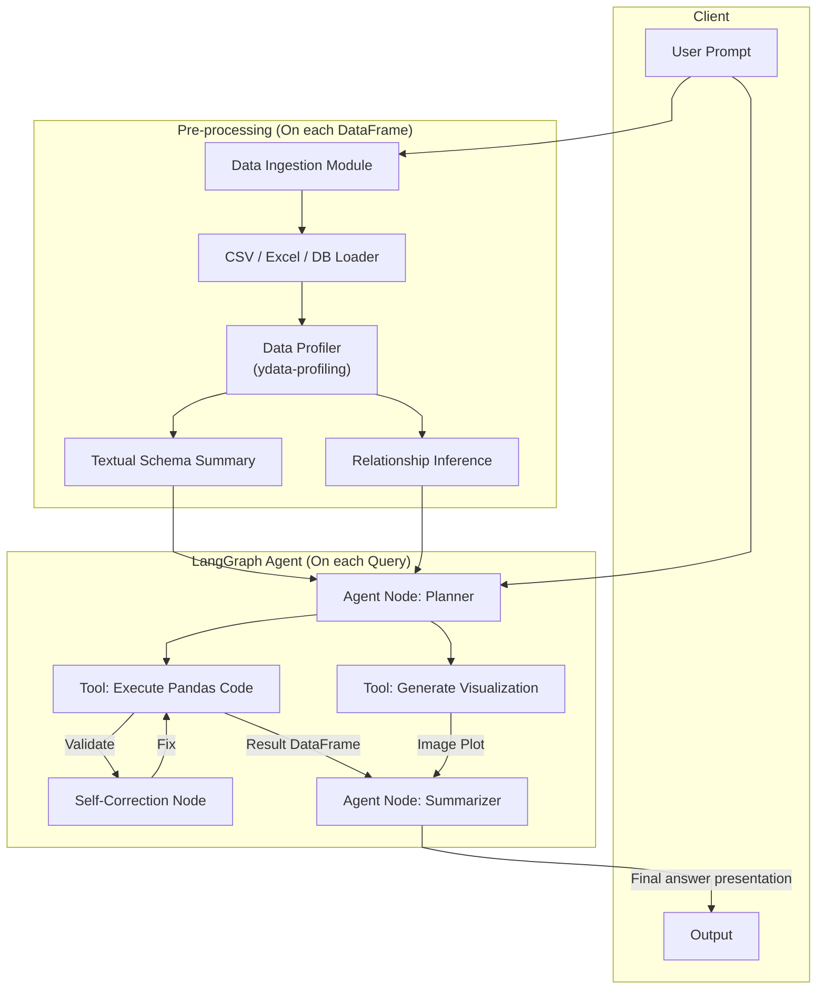

# Context-Aware Text-to-SQL/Pandas Pipeline

## 1. Task Definition

### A. Input

- Query (from User) -> Intent
- DataFrame

### B. Problem Decomposition

- Vấn đề nhận thức dữ liệu (Data Understanding):
      - Tự động profile schema: tên cột, kiểu dữ liệu, sample data, mô tả ý nghĩa (description).
      - Tự động phát hiện quan hệ (Relationship Inference): Dựa trên mẫu dữ liệu (tên cột, kiểu dữ liệu, thống kê, few-shot, etc) để dự đoán đâu là Primary Key (PK), Foreign Key (FK) nếu không có metadata rõ ràng.

- Vấn đề suy luận và lập kế hoạch (Reasoning & Planning):
      - Phân tích ý định người dùng (intent).
      - Mapping ý định đó sang các thực thể dữ liệu cụ thể (chọn bảng, cột).
      - Lập kế hoạch các bước truy vấn: Đơn bảng hay cần join? Lọc dữ liệu ra sao?

- Vấn đề thực thi (Execution):
      - Sinh code Python (Pandas) an toàn, chính xác.
      - Cơ chế tự sửa lỗi (Self-Healing) khi code lỗi (sai tên cột, sai syntax).

- Vấn đề trực quan hóa (Interaction & Visualization):
      - Chuyển đổi kết quả DataFrame thành câu trả lời ngôn ngữ tự nhiên.
      - Kích hoạt sinh biểu đồ (Matplotlib) thông qua code.

## 2. System design

### A. First draft



### B. Work flow

```markdown
User Prompt
    │
    ▼
┌─────────────────────────────────────────────────────────┐
│  Orchestrator (FinancialAssistant)                      │
│                                                         │
│  Step 1: Parse input → UserQuery                        │
│  Step 2: SchemaManager.build_context() → SchemaContext   │
│  Step 3: AgentExecutor.run() với các Tool               │
│          ├── tool_query_data                            │
│          ├── tool_generate_plot                         │
│          └── tool_describe_dataframe                    │
│  Step 4: Collect Output → FinalResult                   │
└─────────────────────────────────────────────────────────┘
    │
    ▼
FinalResult (chứa danh sách OutputCell: text, code, image, table)

```
